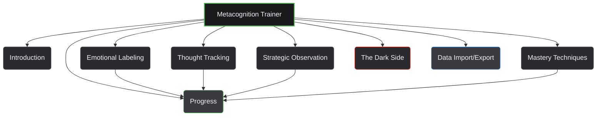

# Metacognition Trainer: Mastermind or Monster? (`meta-cognition.html`)

## Description

This is a simple, single-page web application built with Vue.js designed to help users practice and develop metacognitive skills. It draws inspiration from concepts related to self-awareness, emotional intelligence, strategic thinking, and the potential duality of using these skills for self-improvement ("Mastermind") versus manipulation ("Monster").

The application provides interactive exercises and journaling prompts based on common metacognition techniques, likely derived from a specific transcript or teaching source (judging by the quotes within the code).

## Key Features

*   Interactive modules covering various metacognition techniques.
*   **Emotional Labeling:** Exercises to identify surface vs. deeper emotions and their triggers.
*   **Thought Tracking:** A journal to log, categorize (helpful/harmful, fact/fear, chosen/installed), and analyze thoughts.
*   **Strategic Observation:** A scenario simulator to practice observing social dynamics and micro-reactions.
*   **Mastery Techniques:** Practice specific methods like third-person self-talk and challenging non-factual thoughts.
*   **Progress Tracking:** Monitors user score and assigns a "Mastery Level" (Novice to Mastermind).
*   **The Dark Side:** Explores how metacognitive skills can be misused for manipulation, aiming to build awareness and defense.
*   **Data Persistence:** Automatically saves progress (score, journal entries, practice logs) in the browser's Local Storage.
*   **Data Import/Export:** Allows users to back up their data to a `.json` file and import it later.

## Technology Stack

*   HTML5
*   CSS3 (utilizing CSS Variables for theming)
*   JavaScript (ES6+)
*   Vue.js 3 (loaded via CDN)

## How to Use

1.  Clone or download the repository.
2.  Open the `meta-cognition.html` file directly in a modern web browser (like Chrome, Firefox, Edge, Safari).
3.  No build steps or local server are required.

## Modules Overview

*   **Introduction:** Explains the core concept of metacognition (Level 1 vs. Level 2 thinking).
*   **Emotional Labeling:** Guides users to pause, identify, and understand the nuances of their emotions.
*   **Thought Tracking:** Provides a structured way to log thoughts, question their validity/origin, and analyze their impact.
*   **Strategic Observation:** Uses scenarios to train users in observing subtle cues in social interactions.
*   **Mastery Techniques:** Offers practice for specific cognitive reframing techniques.
*   **Progress:** Displays the user's accumulated score, calculated mastery level, and a visual progress bar.
*   **The Dark Side:** Discusses how these skills can be used manipulatively, focusing on recognition and defense.
*   **Data Import/Export:** Facilitates backing up and restoring application data.

## Data Persistence

All user progress, including the score, journal entries, and practice logs, is automatically saved to the browser's **Local Storage**.

**Important:** Clearing your browser's cache or site data for this page will erase your saved progress unless you have exported it first.

## Data Management

Users can manage their data via the "Data Import/Export" module:

*   **Export:** Click the "Download Data File (.json)" button to save the current state (score, entries, logs) to a JSON file on your computer. This serves as a backup.
*   **Import:** Select a previously exported `.json` file using the file input. Click "Import Data" to load the state from the file.
    *   **Warning:** Importing data will **overwrite** any existing progress currently stored in your browser's Local Storage for this application. A confirmation prompt will appear before overwriting.

## Source / Inspiration

The specific exercises and quotes within the application suggest it's based on a particular video transcript or teaching material focused on practical metacognition and its potential applications, both positive and negative.

---

# Other Project Files

This repository contains several other standalone HTML files and resources:

*   **`index.html` & `script.js`**: A simple blog interface. `index.html` displays posts, and `script.js` handles dynamic category/archive menus, post filtering, and theme customization (colors, animation speed).
*   **`call-tracker.html`**: A call logging tool, potentially for agricultural/business use ("Mandi"). Features include saving call details, follow-ups, history, filtering, and data import/export (CSV/JSON) using local storage.

*   **`Mind-Map.html`**: A web-based mind map creator built with React. Allows creating, editing, deleting nodes, and saving/loading maps as JSON.
*   **`Paddy-Auction-Report.html`**: Displays a report of paddy (rice) weight data, organized by district, collection center, and variety. Includes filtering and download options. Data is hardcoded in the script.
*   **`smell_of_wet_soil.html`**: An informational page explaining the science behind petrichor (the smell of rain on dry earth).
*   **`PLAN.md`**: Contains planning notes for the project (content not detailed here).
*   **`Genspark/` directory**: Contains related files, possibly from a specific course or project phase (contents not detailed here).